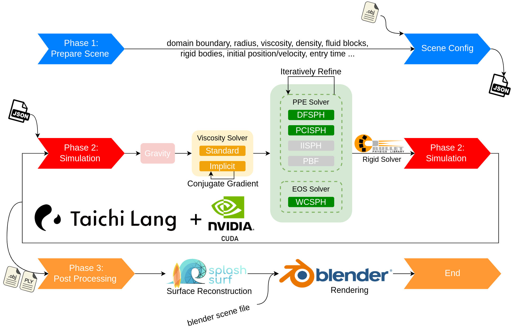

# homework:SPH 流体模拟
这是在笔者大二阶段曾与另外一同学制作基础上进行的进一步开发，借鉴了Tsinghua University的视频并进一步复现

<figure align="center">
  
  <figcaption>Detailed workflow of our SPH simulation framework.</figcaption>
</figure>

我们的SPH（Smoothed Particle Hydrodynamics）模拟框架详细工作流程如下所示：

1. **准备场景阶段：**
   用户在此阶段定义流体和刚体的属性，同时设置模拟参数。这一阶段是模拟的起始点。

2. **模拟阶段：**
   - **引力，黏性和压力力的应用：**
     顺序应用引力、黏性和压力力，这是模拟过程的核心。
   - **流体和刚体的动态更新：**
     针对流体和刚体进行动态更新，包括对粘度（标准和隐式）和压力管理（WCSPH、PCISPH和DFSPH）的各种求解器的应用。

3. **后处理阶段：**
   - **流体粒子的表面重建：**
     使用SplashSurf进行流体粒子的表面重建，以确保场景的准确呈现。
   - **在Blender中渲染场景：**
     利用Blender丰富的社区资源，将场景渲染出来。这一阶段完成后，用户可以享受Blender提供的丰富场景创建功能。

在整个过程中，我们面临了一些挑战，尤其是在正确实现IISPH和将PBF集成到我们的统一框架中时。这些挑战需要仔细的调试和解决，以确保模拟的准确性和稳定性。
